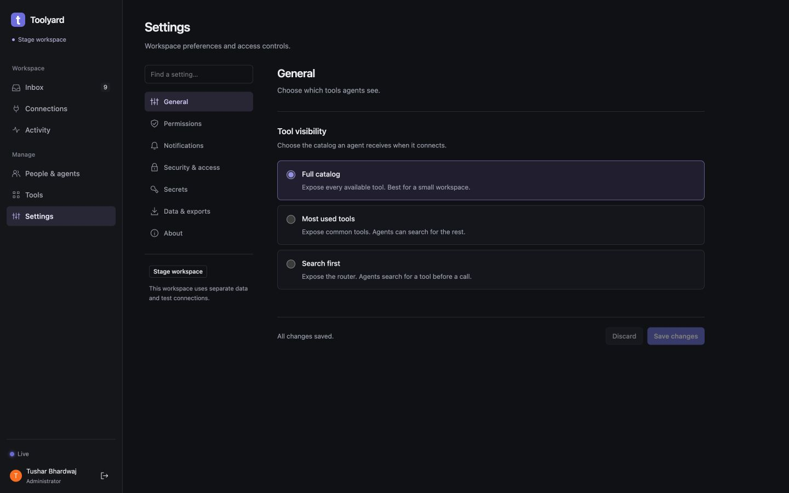
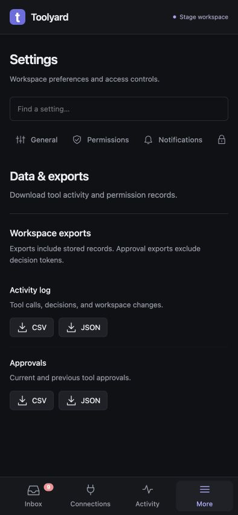
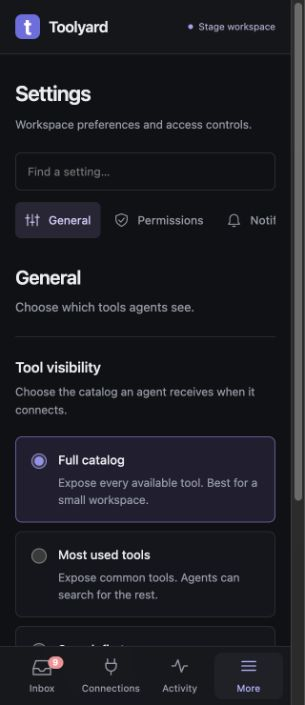

# Toolyard product scope cleanup — 2026-10-04

The laptop review began at `d5dac28` from `origin/t3code/jakarta`. After reviewing the
current desktop and mobile UI, the owner chose product simplification over another
visual redesign. The owner requested removing pricing, full-session streaming UI,
and hook options, then explicitly chose to remove the built-in memory, Events hub,
and voice-call UI entirely.

## Product boundary

Toolyard connects tools to agents, obtains bounded permission, collects answers,
and records tool calls and outcomes. It is not the agent's chat client, session
recorder, model billing dashboard, memory editor, or voice runtime.

Removed from the dashboard:

- Model catalog, automatic-price Settings card, spend placeholder, and payload-token table.
- Hooks/Agent events feed, hook recipes, and Claude/Codex/Cursor/Conductor hook setup tabs.
- Leftover Sessions dashboard and session-event subscription.
- Memory editor and import/export UI, MemPalace metrics and ingestion webhooks.
- General Events hub, webhook/poller configuration and its event subscription.
- Live voice-call panel, microphone capture, audio worklet and call hardware integration.
- Memory fetch at dashboard bootstrap and cost fetch in tool activity.
- About's backend capability badges, which advertised removed UI features.

The agent setup dialog keeps MCP connection instructions and the permission guide.
Request evidence, on-demand Listen, free text and choice answers, snooze, device
notifications, passkeys, secrets, people/agent administration, connector recovery,
Policies and the tool-call audit remain core features.

Old Hooks/Events links open Activity. Memory/MemPalace links open Settings exports.
Call/Sessions links open Inbox. Request links keep their exact IDs, and Settings
category links remain supported. Both initial URLs and later navigation use these
redirects. The Activity sections are now Calls and Tool activity.

## Data and compatibility

This is a UI removal, with no database migration, purge, seed, credential change or
production deployment. Existing data and compatibility APIs remain available.
Session identifiers remain in request/audit attribution; they do not show full
agent conversations. Actual backend capabilities can still appear in the Tools
catalog when available. Pricing refresh/cache and legacy hooks ingestion remain
backend compatibility features; retiring those protocols is a separate decision.
`/v1/insights/cost` still reports unmetered status and null billed spend. MCP payload
sizes are never presented as measured provider billing.

## Further candidates identified

| Candidate | Recommendation | Reason |
| --- | --- | --- |
| Policy toggles and auto-approval configuration inside Tool activity | Move to Policies | Reports duplicate configuration and can unexpectedly widen access. |
| Legacy Approval queue beside Inbox | Eventually combine | Preserve execute-mode callers and exact decision links during a migration. |
| Raw JSON/schema tool workbench | Keep in an advanced developer section | Useful for connector troubleshooting but secondary to reviewing requests. |
| JWT, push diagnostics and destructive push recovery | Keep behind advanced controls | Troubleshooting should not compete with notification setup. |
| Core overview metrics | Keep | Call/error/latency and approval counts describe Toolyard's own work. |
| Session IDs and actor details in audit | Keep | Identify who executed a tool call without collecting an agent transcript. |

The first two are follow-up product changes, not silently applied security or
protocol changes in this cleanup.

## Validation

- JavaScript syntax checks and `git diff --check` passed.
- `node --test scripts/settings-ui.test.cjs scripts/product-scope-ui.test.cjs`: 11 checks passed.
- `GOMAXPROCS=2 go test -p 1 ./cmd/gateway ./internal/api -run '^(TestWorkspaceAssets|TestPricing.*|TestStage.*)$' -count=1`: passed.
- The retained backend pricing/unmetered API checks remain intentional compatibility coverage.
- Live stage checks and screenshots are recorded after the stage update below.

Earlier laptop observations: desktop and 320/394px Settings categories were
accessible; a preference draft survived category changes, navigation and reload,
and Discard restored the saved value. Question drafts survived navigation and
reload. Two issues remain outside this product cleanup: dialog dismissal loses
keyboard focus, and Cmd/Ctrl+Enter does not send a question answer. These must not
be reported as fixed by the feature removals.

## Stage release and measured laptop checks

Application commit `0492eb1` is deployed at <https://toolyard.stage.dev.beknown.live/>.
Health reports `stage-0492eb1`, `ok: true`, two live upstreams and zero dropped
metrics. The SQLite backup is
`/var/lib/toolyard-stage/backups/before-0492eb1.sqlite`; rollback metadata is
`/etc/toolyard-stage/before-0492eb1.json`. Previous release: `a9aec1f`.

Only the stage gateway was restarted. The fixtures PID remained `1367099`; the
production gateway PID remained `1446651`. A deployment filename mistake briefly
produced HTTP 502: the candidate was installed as `toolyard-stage`, while the
service expects `toolyard`. The filename was corrected before successful health
and smoke checks. The runbook now documents the filename and executable check.
No database restore, reset, or credential change occurred.

All 11 live HTTPS/MCP smoke checks passed after recovery: stage identity and secure
cookie, unauthenticated refusal, cross-origin refusal, both synthetic connectors,
question idempotency, permission refusal, changed-parameter refusal, one-use grant,
logical failure, slow response, and simulated sign-in failure.

The Mac's Beknown Chrome profile opened the owner dashboard as Administrator.
The local browser's read-only evaluation API does not expose `fetch`; direct JSON
navigation was blocked by the browser. Thus the local session's raw `/v1/auth/me`
HTTP status was not separately captured. The rendered Admin dashboard and its
admin-only Settings were verified; this is not a claim that a separate server or
cloud browser shares those cookies.

In that signed-in local browser, after the release:

- Desktop General at 1440×900 contains tool visibility and Save/Discard, without prices.
- Data & exports at 394×852 contains activity and approval downloads, without memory import/export.
- General at 320×740 has no page-wide horizontal overflow (`clientWidth == scrollWidth == 305`; the remaining 15 pixels are the browser's vertical scrollbar).
- Hooks and Events bookmarks redirect to Activity; Memory/MemPalace redirect to exports; Call and Inbox/Sessions redirect to Inbox.
- Activity has Calls and Tool activity, with no Agent events section or model pricing/spend cards.
- The three synthetic laptop-review questions saved free text, one choice, and two choices successfully. A single choice in a minimum-two question showed validation and allowed correction before Send. Selecting a choice alone did not submit.
- Existing feedback questions stayed intact; only synthetic checks were answered.

Agent setup's removed hook tabs were verified by the UI behavior harness, without
creating a new credential in the live browser. Failed-save retention is covered
by the Settings behavior checks; live network-failure simulation and physical
mobile hardware were not tested in this cleanup.

A remaining responsive issue: switching a desktop Settings page to a narrow
viewport can leave the selected category outside the horizontal category strip.
All categories remain reachable; selecting them scrolls them into view. This,
dialog focus return, and the unanswered Cmd/Ctrl+Enter shortcut issue remain
follow-up polish items.

Screenshots:

The retained Permissions form was also checked with a reversible synthetic
File location guidance edit: Save reported success, reload retained the value,
and a second Save restored the original blank value. All seven category headings
were reached in the deployed local browser. README product scope and Settings
paths now describe the reduced dashboard rather than the retired surfaces.
